# WorkSafe — AI-Powered Parametric Income Protection for India's Gig Economy

## Overview

WorkSafe is a parametric insurance platform purpose-built for India's platform-based delivery partners — the riders working for Zomato, Swiggy, Zepto and similar services. These workers form the backbone of India's digital commerce layer, yet they operate without any financial safety net when external disruptions wipe out their ability to earn.

This platform monitors environmental, infrastructural, and social disruptions in real time, automatically triggers claims when conditions breach predefined thresholds, and settles payouts instantly — all without the rider filing a single form.

**Key distinction:** WorkSafe insures *lost income*, not health, accidents, vehicle damage, or any other traditional insurance category. The entire financial model operates on a **Rolling Weekly Subscription** aligned with how gig workers actually get paid.

---

## Problem Statement

India's gig delivery workforce — estimated at over 7 million workers — faces a fundamental asymmetry: they bear 100% of the financial risk from events entirely outside their control.

When a cloudburst floods a delivery zone, when AQI crosses hazardous thresholds, when an unannounced curfew shuts down a neighborhood — riders simply stop earning. There is no sick leave, no employer-backed coverage, no safety net.

The consequences are concrete:
- **20–30% monthly income loss** during disruption-heavy periods (monsoons, pollution seasons, civil unrest).
- Zero compensation from platforms for hours lost to external events.
- No existing insurance product designed around the weekly earning cycle of gig work.

**Our mission:** Build an AI-enabled parametric insurance system that detects these disruptions autonomously, validates them through multi-layered fraud prevention, and settles income-replacement payouts within minutes — not weeks.

---

## Key Features

- **AI-Powered Dynamic Pricing** — Weekly premiums calculated via predictive risk models incorporating hyper-local weather forecasts, historical claim data, and zone-specific risk multipliers.
- **Parametric Automation** — Real-time monitoring of environmental and social conditions across city polygons with automatic claim triggering when disruption thresholds are breached.
- **Multi-Layered Fraud Detection** — GPS velocity checks (Haversine Speed Trap), AI-powered image validation with Moiré pattern detection, and logarithmic crowdsource thresholding.
- **Zero-Touch Claims** — Riders never file paperwork. The system detects, validates, calculates, and pays — end to end.
- **Adverse Selection Prevention** — A mathematically enforced consistency matrix penalizes subscription gaming and rewards long-term coverage loyalty.
- **Spatial Intelligence** — PostGIS-backed polygon operations for precise zone-level disruption tracking and rider geofencing.
- **Instant Settlement** — Payout credited directly to the rider's platform ledger via simulated payment rails (Razorpay sandbox).

---

## System Architecture



### Architectural Foundation

| Layer | Technology | Purpose |
|-------|-----------|---------|
| **Backend Core** | Node.js / Express.js | Lightweight, JSON-native API gateway with `node-cron` for scheduled polling and premium calculation cycles |
| **Spatial Database** | PostgreSQL + PostGIS | Stores delivery zones as strict geometric polygons (GeoJSON); offloads all spatial math (`ST_Contains`, geofencing) from Node.js to the database layer |
| **ML Service** | Python / FastAPI | Isolated microservice hosting CLIP-based image classification and Moiré pattern detection for fraud prevention |
| **Frontend** | React.js + Tailwind CSS | Mobile-responsive web interface simulating a native platform tab |

---

## End-to-End Workflow

### Stage 1: Frictionless B2B2C Onboarding & Baseline Synchronization

**Objective:** Seamlessly ingest the rider into the risk pool without manual data entry, establishing the terms of the Weekly pricing model.

**1.1 — Native Integration**
The rider accesses the delivery platform (Zomato, Swiggy, etc.) and finds a newly integrated **"Income Protection"** tab directly within their primary dashboard. No separate app, no external redirect.

**1.2 — Automated Data Ingestion**
Upon accessing the tab, the Express.js backend securely queries the platform's internal APIs to fetch the rider's historical operational profile:

- **Primary Delivery Hub** — Mapped to an existing GeoJSON polygon in the database (e.g., `Zone_Indiranagar`).
- **Operational Rhythms** — Average hours worked per day and preferred shift timings (morning, evening, late-night).
- **Financial Baseline** ($E_{avg}$) — The rider's established average hourly earning rate.

**1.3 — Verification & Consent Protocol**
- The UI renders a clean summary of fetched data for the rider to verify.
- **Compliance mandate:** The onboarding screen explicitly requires acknowledgment that this policy covers **loss of income only** — strictly excluding vehicle repairs, health, or accident coverage.
- The rider accepts the **Rolling Weekly Subscription** terms, entering the dynamic pricing pool.

---

### Stage 2: The Financial Engine & Adverse Selection Mitigation

**Objective:** Calculate dynamic premiums via predictive risk modeling while mathematically preventing "fair-weather" subscription fraud.

**2.1 — The Weekend Calculation Cycle (Saturday 11:00 PM)**
A `node-cron` scheduled job initiates the weekly pricing calculation for all active users. The backend queries external APIs (Tomorrow.io, PredictHQ) for 7-day forecasts covering extreme weather, pollution, and localized social disruptions.

**2.2 — Math Model 1: Predictive Pricing & Consistency Matrix**

The AI calculates the upcoming week's premium:

$$
\text{Premium\%} = \left[ P_{base} + \left( \alpha \cdot H_{risk} \right) + \left( \beta \cdot W_{risk} \right) + \left( \gamma \cdot S_{risk} \right) \right] \times R_{geo} \times C_{factor}
$$

| Variable | Description |
|----------|-------------|
| $P_{base}$ | Absolute minimum platform fee |
| $H_{risk}$ | Hourly exposure index (12-hour rider carries higher risk than a 2-hour rider) |
| $W_{risk}$ | Environmental disruption probability for the specific week |
| $S_{risk}$ | Social disruption probability for the specific week |
| $R_{geo}$ | Multiplier based on historical claim frequency of the rider's primary polygon |
| $C_{factor}$ | **Anti-fraud consistency factor** (see below) |

**The Anti-Fraud Consistency Matrix** ($C_{factor}$):

The system queries the rider's `subscription_streak` ledger:
- **12+ weeks continuous coverage** → $C_{factor} = 0.85$ (Loyalty Discount)
- **Detected adverse selection** (canceled during clear weather, re-subscribing before a forecasted flood) → $C_{factor} \geq 2.5$, mathematically taxing the gaming behavior.

**2.3 — Transparent Ledger Deduction (Sunday 11:59 PM)**
- The rider receives an automated push notification detailing next week's premium, with a **24-hour opt-out window**.
- If no opt-out is registered, the premium is deducted directly from the current week's platform payout, securing the insurer's operating float.

---

### Stage 3: Concurrent Active Polygon Monitoring

**Objective:** Real-time trigger monitoring and parametric automation across the entire metropolitan grid.

**3.1 — The 15-Minute Polling Loop**
A `node-cron` scheduled task iterates through all operational city zones in the database every 15 minutes. For each independent polygon, it fetches hyper-local, real-time data from Weather and Traffic APIs using async/await concurrency.

**3.2 — Math Model 3: Live Disruption Index ($DI$)**

The backend normalizes disparate API data into a single actionable metric (0–100) for every zone:

$$DI = \left( w_1 \cdot I_{weather} \right) + \left( w_2 \cdot I_{traffic} \right) + \left( w_3 \cdot \min\left(100,\ U_{ratio} \cdot 100\right) \right)$$

| Component | Source |
|-----------|--------|
| $I_{weather}$ | Normalized weather severity from OpenWeatherMap / Tomorrow.io |
| $I_{traffic}$ | Normalized traffic disruption from TomTom Traffic API |
| $U_{ratio}$ | Crowdsourced verification ratio (see Stage 4) |

The system continuously checks whether any zone's $DI$ breaches the **critical payout threshold** ($DI \geq 75$).

---

### Stage 4: Disruption Event & Intelligent Fraud Defense

**Objective:** Validate disruptions and execute automatic claim initiation, backed by multi-layered fraud detection.

#### Scenario A — API Zero-Touch Trigger
1. A sudden cloudburst occurs. Weather and Traffic APIs push `Zone_Koramangala`'s $DI$ to **88**.
2. PostGIS spatial query fires:
   ```sql
   SELECT rider_id FROM active_sessions
   WHERE ST_Contains(Zone_Koramangala_geom, rider_current_location);
   ```
3. The isolated cohort of affected riders is immediately flagged for the settlement protocol.

#### Scenario B — Crowdsourced Fallback (When APIs Fail)
An unmapped local strike halts deliveries. APIs fail to register the event. A rider uses the **"Report Disruption"** feature.

**Anti-Fraud Layer 1 — Client-Side OS Validation**
- The UI strictly **disables gallery uploads**, forcing live camera capture via `MediaDevices.getUserMedia()`.
- Verifies that no native "Mock Location" developer settings are active on the device.

**Anti-Fraud Layer 2 — The Haversine Speed Trap**

To prevent location spoofing and duplicate claim fraud:

1. Retrieve the rider's previous logged ping: $(lat_1, lon_1)$ at $timestamp_1$.
2. Receive new report coordinates: $(lat_2, lon_2)$ at $timestamp_2$.
3. Calculate:

$$Velocity = \frac{\text{Haversine}(lat_1, lon_1, lat_2, lon_2)}{t_2 - t_1}$$

4. If velocity exceeds standard urban limits (e.g., $> 80$ km/h), the data is flagged as **physically impossible** and the claim is rejected instantly.

**Anti-Fraud Layer 3 — AI Vision Validation**
- The validated image is forwarded to the Python ML microservice.
- **CLIP (Zero-Shot Classification)** confirms the visual presence of a disruption (flood, protest, heavy traffic, etc.).
- **Moiré Pattern Detection** (OpenCV) scans for screen-capture artifacts — wavy pixel lines and glare patterns that indicate a photo taken of a laptop/phone screen displaying a fake disaster image.

#### Math Model 2: Dynamic Logarithmic Thresholding

To prevent a single bad actor from triggering a zone-wide payout, the system calculates the minimum required verified uploads ($U_{min}$):

$$U_{min} = \max\left( U_{base},\ \lceil k \cdot \ln(N + 1) \rceil \right)$$

| Variable | Description |
|----------|-------------|
| $U_{base}$ | Minimum baseline number of reports required |
| $k$ | Scaling constant |
| $N$ | Live density of active riders in the specific polygon |

Once the required number of independent riders submit verified reports, $U_{ratio}$ reaches $1.0$, artificially spiking the zone's $DI$ to **100** and triggering the override.

---

### Stage 5: Automated Settlement & Ledger Reconciliation

**Objective:** Execute instant payout processing for lost income and close the operational loop.

**5.1 — Safety Halt Directive**
All premium-paying riders pinging inside the breached polygon receive a priority push notification:

> *"Disruption verified. Cease deliveries. Income protection activated."*

**5.2 — Math Model 4: Financial Compensation Formula**

$$Payout = E_{avg} \cdot H_{lost} \cdot C_{ratio}$$

| Variable | Description |
|----------|-------------|
| $E_{avg}$ | Rider's established average hourly earning rate |
| $H_{lost}$ | Hours remaining in the rider's historically established daily shift |
| $C_{ratio}$ | Coverage Ratio — prevents moral hazard by capping payout below full earnings |

**5.3 — Instant Payout Execution**
- The computed payout amount is transmitted to simulated payment systems (Razorpay test mode / sandbox).
- Funds are immediately credited to the rider's platform ledger, replacing the income lost to the uncontrollable external event.

---

## Fraud Prevention Architecture
WorkSafe implements a defense-in-depth approach across four distinct layers:

| Layer | Mechanism | What It Catches |
|-------|----------|-----------------|
| **Client-Side OS** | Forced live camera capture; gallery upload disabled; mock location detection | Fake/recycled photos, GPS developer spoofing |
| **Haversine Speed Trap** | Server-side velocity calculation between consecutive location pings | Location spoofing, physically impossible movements |
| **AI Vision (CLIP + OpenCV)** | Zero-shot image classification + Moiré pattern detection | Non-disruption photos, screen-captured fake images |
| **Logarithmic Crowdsource Threshold** | $U_{min}$ scales with zone rider density; requires independent corroboration | Single bad actors attempting to trigger zone-wide payouts |
| **Consistency Matrix** | $C_{factor}$ penalizes adverse selection in subscription patterns | "Fair-weather" subscribers gaming forecast data |

---

## Tech Stack

### Frontend
| Technology | Role |
|-----------|------|
| **React.js** | Component-based UI for dashboard, onboarding, premium display, and claim views |
| **Tailwind CSS** | Rapid, mobile-responsive styling matching modern app aesthetics |
| **Mapbox GL JS / Leaflet.js** | Interactive polygon visualization over OpenStreetMap base tiles |
| **navigator.geolocation** | Precise lat/long capture for disruption reports |
| **MediaDevices.getUserMedia()** | Enforced live camera capture within the browser (anti-fraud) |

### Backend
| Technology | Role |
|-----------|------|
| **Node.js / Express.js** | Fast, JSON-native API gateway handling route logic, API orchestration, and business rules. Delegates spatial math to PostGIS rather than computing it in-process |
| **node-cron** | Weekend premium calculation cycles, 15-minute disruption polling loops |
| **Haversine Engine** | Server-side GPS velocity validation (primary defense against spoofing in web context) |

### Database
| Technology | Role |
|-----------|------|
| **PostgreSQL** | Relational data store for riders, policies, claims, subscription ledgers |
| **PostGIS Extension** | Spatial operations — stores delivery zones as GeoJSON polygons; executes `ST_Contains` queries for rider geofencing |

### ML / AI Microservice
| Technology | Role |
|-----------|------|
| **Python / FastAPI** | Isolated inference service called via REST from the Express.js backend |
| **Hugging Face — CLIP** | Zero-shot image classification (flood/protest/traffic/normal) without custom model training |
| **OpenCV** | Moiré pattern and screen-glare detection for photo authenticity validation |

---

## API Integrations

### Weather & Micro-Disruption Triggers
| API | Purpose |
|-----|---------|
| **OpenWeatherMap** | Standard rainfall, temperature, and severe weather alerts for zone monitoring |
| **Tomorrow.io** | Hyper-local predictive weather modeling for weekly premium calculation (Math Model 1) |

### Macro-Disaster Failsafes
| API | Purpose |
|-----|---------|
| **NASA EONET** | Real-time natural event tracking — wildfires, volcanic activity intersecting city polygons |
| **USGS** | Earthquake detection — auto-spikes Disruption Index to 100 for affected zones |

### Traffic & Infrastructure Proxies
| API | Purpose |
|-----|---------|
| **TomTom Traffic API** | Traffic Index as a proxy for undocumented disruptions — if vehicle speeds drop 80% in a zone with no rain, it signals a localized strike or road blockage |

### Social Disruption Intelligence
| API | Purpose |
|-----|---------|
| **NewsAPI** | Real-time headline scraping for keywords: "Strike," "Protest," "Curfew" in target cities |
| **PredictHQ** | Structured data for scheduled events (political rallies, planned demonstrations) — feeds into predictive weekly premium |

### Financial Settlement
| API | Purpose |
|-----|---------|
| **Razorpay Test API (Sandbox)** | Simulated instant fund transfer to rider wallets, demonstrating zero-touch claim settlement |

---

## Data Flow



1. **Ingest** — External APIs feed weather, traffic, news, and event data into the backend every 15 minutes.
2. **Compute** — The Disruption Index is recalculated per polygon. Weekly premiums are computed every Saturday night.
3. **Detect** — When $DI \geq 75$ or sufficient crowdsourced reports pass all fraud layers, a disruption event is confirmed.
4. **Validate** — Affected riders are identified via PostGIS spatial queries. Images (if crowdsourced) pass through CLIP and OpenCV.
5. **Settle** — Payout is calculated using the compensation formula and instantly credited via Razorpay sandbox.

---

## Deployment & Execution Flow

```
1. PostgreSQL + PostGIS initialized with city zone polygons (GeoJSON)
2. Node.js/Express backend starts — node-cron jobs register, polling loops activate
3. FastAPI ML service starts — CLIP model loaded, OpenCV pipeline ready
4. React frontend served — connects to backend APIs
5. Rider onboards via platform tab → data fetched, consent captured
6. Saturday 11 PM → weekly premium calculated and queued
7. Sunday 11:59 PM → premium deducted from platform payout
8. Continuous → 15-minute DI polling across all zones
9. Disruption detected → zero-touch claim or crowdsource validation
10. Payout computed and credited → rider notified
```

---

## Impact

WorkSafe transforms income protection from a reactive, paperwork-heavy process into a fully automated, trust-minimized system. By combining spatial intelligence, predictive risk modeling, and multi-layered fraud prevention, it delivers a product that:

- **Protects the most vulnerable workforce** in India's digital economy from financial shocks they cannot control.
- **Aligns with gig worker economics** through weekly pricing, platform-native integration, and zero-friction claims.
- **Maintains actuarial viability** through adverse selection penalties, logarithmic crowdsource thresholds, and coverage ratio caps.
- **Scales horizontally** — adding a new city means adding polygons to the database and API polling targets. The math, fraud layers, and settlement logic are zone-agnostic.

This is not a traditional insurance product retrofitted for gig workers. It is a parametric income protection system engineered from first principles around how platform-based delivery partners actually work, earn, and lose money.
